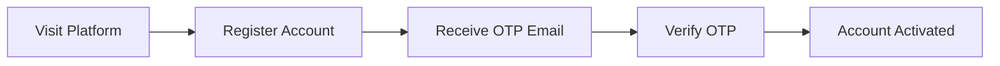
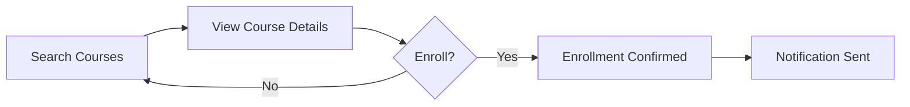
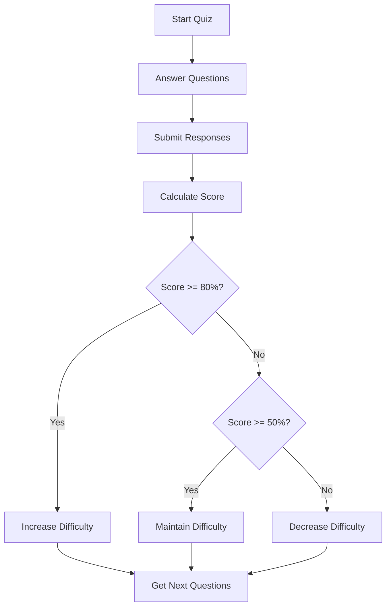
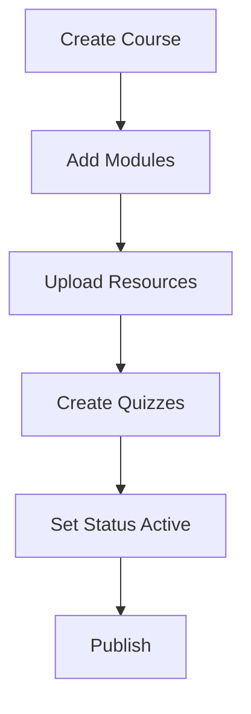

# E-Learning Platform - User Flow Documentation

> Comprehensive workflows for all user roles within the E-Learning Platform

---

## 📑 Table of Contents

- [Student Workflow](#-student-workflow)
- [Instructor Workflow](#-instructor-workflow)
- [Admin Workflow](#-admin-workflow)
- [API Reference Quick Guide](#-api-reference-quick-guide)

---

## 🎓 Student Workflow

### Overview
Students can browse courses, enroll, learn through multimedia content, take adaptive quizzes, and track their progress.

---

### Step 1: Registration & Email Verification



**API Endpoints:**
| Action | Method | Endpoint | Body |
|--------|--------|----------|------|
| Register | POST | `/auth/register` | `{ name, email, password }` |
| Verify OTP | POST | `/auth/verify-otp` | `{ email, otpCode }` |
| Login | POST | `/auth/login` | `{ email, password }` |

**Business Rules:**
- ✅ Password must be minimum 8 characters
- ✅ Email must be unique and valid format
- ✅ OTP expires after 10 minutes
- ✅ Maximum 3 OTP resend attempts per hour
- ✅ Account locked after 5 failed login attempts (30 min lockout)

---

### Step 2: Profile Setup

**API Endpoints:**
| Action | Method | Endpoint |
|--------|--------|----------|
| Get Profile | GET | `/users/me` |
| Update Profile | PATCH | `/users/me` |

**Available Profile Fields:**
- `name` - Display name
- `learningPreferences` - Array of preferred learning styles
- `subjectsOfInterest` - Array of topics
- `profileImage` - Avatar URL

---

### Step 3: Browse & Enroll in Courses



**API Endpoints:**
| Action | Method | Endpoint | Notes |
|--------|--------|----------|-------|
| Search Courses | GET | `/courses/search?title=...&tag=...` | Paginated |
| Get Course | GET | `/courses/:id` | Full details |
| Enroll | PATCH | `/courses/:id/enroll` | Auto-notification |
| My Courses | GET | `/courses/enrolled` | Student only |

**Business Rules:**
- ✅ Only students can enroll
- ✅ Cannot enroll twice in same course
- ✅ Enrollment confirmation notification sent automatically
- ✅ Course must be in "active" status

---

### Step 4: Access Course Content

**Resource Types:**
| Type | Description | Player |
|------|-------------|--------|
| `video` | MP4, WebM | Video Player |
| `pdf` | Documents | PDF Viewer |
| `link` | External URL | New tab |

**API Endpoints:**
| Action | Method | Endpoint |
|--------|--------|----------|
| List Resources | GET | `/courses/:id/modules/:idx/resources` |
| Get Resource | GET | `/courses/:id/modules/:idx/resources/:rid` |

---

### Step 5: Take Notes

**API Endpoints:**
| Action | Method | Endpoint |
|--------|--------|----------|
| Create Note | POST | `/notes` |
| Get Notes | GET | `/notes/:courseId` |
| Update Note | PATCH | `/notes/:noteId` |
| Delete Note | DELETE | `/notes/:noteId` |

**Note Schema:**
```json
{
  "courseId": "string",
  "moduleIndex": 0,
  "resourceId": "optional",
  "content": "string"
}
```

---

### Step 6: Take Adaptive Quizzes



**API Endpoints:**
| Action | Method | Endpoint |
|--------|--------|----------|
| Get Quiz | GET | `/quizzes/:id` |
| Submit Attempt | POST | `/quiz-attempts/attempt` |
| My Attempts | GET | `/quiz-attempts/my-attempts` |

**Attempt Response:**
```json
{
  "score": 85,
  "correctAnswers": 17,
  "totalQuestions": 20,
  "details": [...],
  "nextDifficulty": "hard",
  "nextQuestions": [...]
}
```

**Adaptive Algorithm:**
- Score ≥ 80% → Next difficulty: **Hard**
- Score 50-79% → Next difficulty: **Medium**
- Score < 50% → Next difficulty: **Easy**

---

### Step 7: Participate in Forums

**API Endpoints:**
| Action | Method | Endpoint |
|--------|--------|----------|
| Get Forum | GET | `/forums/course/:courseId` |
| Add Thread | POST | `/forums/:forumId/threads` |
| Add Post | POST | `/forums/:forumId/threads/:threadId/posts` |
| Like Post | PATCH | `/forums/:forumId/threads/:threadId/posts/:postId/like` |

**Business Rules:**
- ✅ Must be enrolled to participate
- ✅ Can only delete own posts/threads
- ✅ Like toggles (like/unlike)

---

### Step 8: Real-Time Communication

**Chat Features:**
- Direct messages with instructors/peers
- Group study chats
- Course-linked conversations

**API Endpoints:**
| Action | Method | Endpoint |
|--------|--------|----------|
| Start DM | POST | `/chat/direct/:userId` |
| Create Group | POST | `/chat/group` |
| Get Conversations | GET | `/chat/conversations` |
| Send Message | POST | `/chat/conversations/:id/messages` |
| Get Messages | GET | `/chat/conversations/:id/messages` |
| Mark Read | PATCH | `/chat/conversations/:id/read` |
| Unread Count | GET | `/chat/unread-count` |

---

### Step 9: Track Progress

**API Endpoints:**
| Action | Method | Endpoint |
|--------|--------|----------|
| Save Progress | POST | `/progress/save` |
| Get Progress | GET | `/progress/:courseId` |
| Summary | GET | `/progress` |
| Analytics | GET | `/analytics/student/:id/summary` |

**Progress Metrics:**
- Completion percentage
- Completed resources
- Quiz scores
- Engagement time
- Current position

---

### Step 10: Notifications

**API Endpoints:**
| Action | Method | Endpoint |
|--------|--------|----------|
| Get Notifications | GET | `/notifications` |
| Mark Read | PATCH | `/notifications/:id/read` |
| Mark All Read | PATCH | `/notifications/read-all` |
| Delete | DELETE | `/notifications/:id` |

**Notification Types:**
- `enrollment` - Course enrollment confirmation
- `courseUpdate` - New content or changes
- `announcement` - Instructor/admin messages
- `newMessage` - Chat notifications

---

## 👨‍🏫 Instructor Workflow

### Overview
Instructors create courses, manage content, track student progress, and interact with learners.

---

### Step 1: Registration & Profile

**Process:**
1. Register with `role: "instructor"`
2. Verify email via OTP
3. Complete profile with expertise

**Profile Fields:**
- `name` - Display name
- `expertise` - Array of specializations
- `profileImage` - Avatar URL

---

### Step 2: Course Creation



**API Endpoints:**
| Action | Method | Endpoint |
|--------|--------|----------|
| Create Course | POST | `/courses` |
| Add Module | POST | `/courses/:id/modules` |
| Upload Resource | POST | `/courses/:id/modules/:idx/resources/upload` |
| Add Link | POST | `/courses/:id/modules/:idx/resources/link` |
| Create Quiz | POST | `/quizzes` |
| Update Course | PATCH | `/courses/:id` |

**Course Schema:**
```json
{
  "title": "Course Title",
  "description": "Description",
  "tags": ["tag1", "tag2"],
  "modules": [...],
  "status": "draft|active|archived",
  "certificateAvailable": true
}
```

**Business Rules:**
- ✅ Instructors can only modify own courses
- ✅ Course starts in "draft" status
- ✅ Maximum file size: 50MB
- ✅ Allowed file types: video/*, application/pdf

---

### Step 3: Quiz Management

**Create Adaptive Quiz:**
```json
{
  "moduleId": "...",
  "questions": [
    {
      "questionText": "What is...?",
      "choices": ["A", "B", "C", "D"],
      "correctAnswer": "A",
      "difficulty": "easy|medium|hard"
    }
  ],
  "adaptive": true
}
```

**API Endpoints:**
| Action | Method | Endpoint |
|--------|--------|----------|
| Create Quiz | POST | `/quizzes` |
| Update Quiz | PATCH | `/quizzes/:id` |
| Delete Quiz | DELETE | `/quizzes/:id` |
| Get by Module | GET | `/quizzes/module/:moduleId` |

---

### Step 4: Monitor Students

**Analytics Available:**
- Enrollment count
- Average quiz scores
- Completion rates
- Engagement minutes
- Difficulty distribution

**API Endpoints:**
| Action | Method | Endpoint |
|--------|--------|----------|
| Course Report | GET | `/analytics/instructor/:id/course/:courseId/report` |
| Dashboard | GET | `/analytics/instructor/:id/dashboard` |
| Export CSV | GET | `/analytics/.../export?format=csv` |

---

### Step 5: Student Interaction

**Communication Options:**
1. **Forum Posts** - Reply to student questions
2. **Direct Chat** - Private messaging
3. **Announcements** - Course-wide notifications

**API Endpoints:**
| Action | Method | Endpoint |
|--------|--------|----------|
| Reply to Thread | POST | `/forums/:id/threads/:tid/posts` |
| Send Announcement | POST | `/notifications/course/:courseId` |

---

### Step 6: Course Updates

**Version Control:**
```json
{
  "version": "1.1.0",
  "changes": "Added new quiz questions"
}
```

**API Endpoint:**
| Action | Method | Endpoint |
|--------|--------|----------|
| Add Version | POST | `/courses/:id/version-history` |

---

## 🔧 Admin Workflow

### Overview
Administrators manage users, monitor security, handle backups, and send platform announcements.

---

### Step 1: Authentication

- Admin credentials via secure setup
- Full JWT authentication
- Access to all platform features

---

### Step 2: User Management

**API Endpoints:**
| Action | Method | Endpoint |
|--------|--------|----------|
| List Users | GET | `/admin/users?role=&verified=&q=` |
| Create User | POST | `/admin/create-user` |
| Update User | PATCH | `/admin/:id` |
| Delete User | DELETE | `/admin/:id` |
| Change Role | PATCH | `/admin/users/:id/role` |

**Query Parameters:**
- `role` - Filter by role (student, instructor, admin)
- `verified` - Filter by email verification (true/false)
- `q` - Search by name or email
- `page`, `limit` - Pagination

---

### Step 3: Course Oversight

**Capabilities:**
- View all courses
- Archive/remove courses
- Override instructor restrictions

**Business Rules:**
- ✅ Admins can modify any course
- ✅ Archiving preserves data
- ✅ Hard delete requires confirmation

---

### Step 4: Security Monitoring

**Metrics Dashboard:**
```json
{
  "users": {
    "total": 1500,
    "byRole": { "student": 1400, "instructor": 95, "admin": 5 },
    "verified": 1450,
    "mfaEnabled": 200
  },
  "security": {
    "failedLogins24h": 23,
    "unauthorizedAccess24h": 5,
    "tokenBlacklisted24h": 10
  }
}
```

**API Endpoints:**
| Action | Method | Endpoint |
|--------|--------|----------|
| Metrics | GET | `/admin/metrics` |
| Security Overview | GET | `/admin/security` |
| Audit Logs | GET | `/audit` |
| Unlock User | PATCH | `/admin/users/:id/unlock` |

**Monitored Events:**
- `LOGIN_FAILED` - Failed authentication
- `UNAUTHORIZED_ACCESS` - Permission denied
- `TOKEN_BLACKLISTED` - Logout events
- `ROLE_CHANGED` - Permission changes
- `ADMIN_USER_LOCK` - Account lockouts

---

### Step 5: Data Backup

**Backup Types:**
- Scheduled (daily at 2 AM)
- Manual (on-demand)

**API Endpoints:**
| Action | Method | Endpoint |
|--------|--------|----------|
| Create Backup | POST | `/api/backups/create` |
| List Backups | GET | `/api/backups/list` |
| Delete Backup | DELETE | `/api/backups/:filename` |

**Backup Options:**
```json
{
  "name": "backup-name",
  "oplog": false,
  "dumpDbUsersAndRoles": false
}
```

---

### Step 6: Platform Announcements

**API Endpoints:**
| Action | Method | Endpoint |
|--------|--------|----------|
| All Users | POST | `/notifications/announce/all` |
| By Role | POST | `/notifications/announce/role/:role` |

**Business Rules:**
- ✅ Only admins can send platform-wide announcements
- ✅ Notifications delivered to all matching users
- ✅ Audit logged for accountability

---

## 📖 API Reference Quick Guide

### Authentication Headers
All protected endpoints require:
```
Authorization: Bearer <jwt_token>
```

### Response Format
```json
{
  "data": {...},
  "message": "Success",
  "statusCode": 200
}
```

### Error Format
```json
{
  "statusCode": 400,
  "message": "Error description",
  "error": "Bad Request"
}
```

### Pagination
Most list endpoints support:
- `page` - Page number (default: 1)
- `limit` - Items per page (default: 20, max: 100)

Response includes:
```json
{
  "items": [...],
  "total": 100,
  "page": 1,
  "limit": 20,
  "pages": 5
}
```

---

## 🔐 Security Checklist

| Feature | Status |
|---------|--------|
| JWT Authentication | ✅ |
| Email Verification (OTP) | ✅ |
| Password Hashing (bcrypt) | ✅ |
| Role-Based Access Control | ✅ |
| Rate Limiting (100 req/min) | ✅ |
| Account Lockout (5 attempts) | ✅ |
| Input Validation | ✅ |
| Input Sanitization | ✅ |
| Security Headers (Helmet) | ✅ |
| CORS Configuration | ✅ |
| Audit Logging | ✅ |
| Token Blacklisting | ✅ |
| Data Backup | ✅ |

---

**Last Updated:** January 2026

